# Event Registration System

A lightweight, no-installation event registration platform. Organisers generate a branded event page in minutes; participants register through a clean three-step form. All responses land instantly in a Google Sheet and every registrant receives an automated confirmation email.

**Live demo:** [https://asvdj.netlify.app](https://asvdj.netlify.app)

---

## Table of Contents

1. [How It Works](#how-it-works)
2. [Part 1 — Organiser: Setting Up an Event](#part-1--organiser-setting-up-an-event)
3. [Part 2 — Participant: Registering for an Event](#part-2--participant-registering-for-an-event)
4. [Confirmation Email](#confirmation-email)
5. [Data Storage — Google Sheets](#data-storage--google-sheets)
6. [Features](#features)

---

## How It Works

```
Organiser fills in event details
          │
          ▼
   System generates a unique shareable link
          │
          ▼
   Organiser shares link with participants
          │
          ▼
Participant opens link → sees event page → completes 3-step registration form
          │
          ▼
   Data saved to Google Sheet  +  Confirmation email sent automatically
```

---

## Part 1 — Organiser: Setting Up an Event

Open the base URL ([https://asvdj.netlify.app](https://asvdj.netlify.app)) without any parameters. You will land on the **Event Setup** builder.

---

### Step 1 — Fill in Event Details

Enter the event name, tagline, date, time, venue, and a short about section.

| Field | Example Value |
|---|---|
| Event Name | ASVDJ Annual Meet 2026 |
| Tagline | A day of community, celebration and inspiration |
| Date | Saturday, 21 June 2026 |
| Time | 10:00 AM – 5:00 PM |
| Venue | Hilton London Heathrow, Terminal 4, TW6 3AF |
| About | Join fellow members for a full day of devotional programmes, cultural performances, a catered lunch, and an inspiring keynote address. All are welcome. |

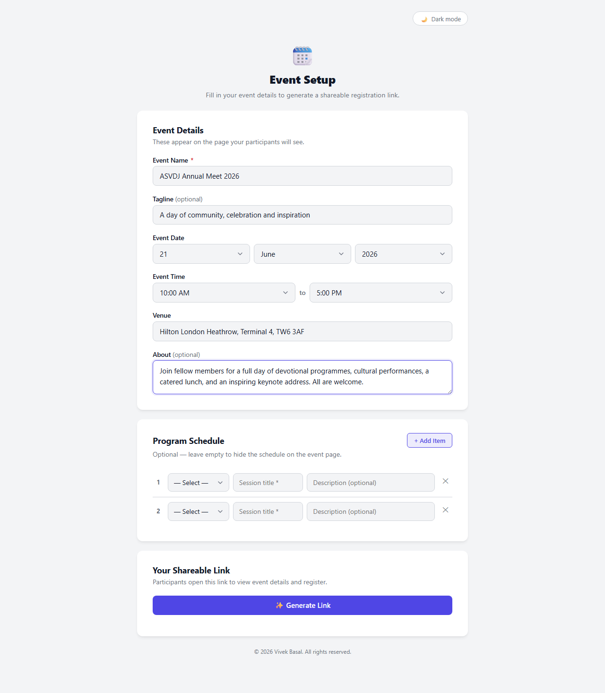

---

### Step 2 — Build the Programme Schedule

Click **+ Add Item** to add timed programme slots. Each row takes a time, a session title, and an optional description.

| # | Time | Session Title | Description |
|---|---|---|---|
| 1 | 10:00 AM | Welcome & Registration | Doors open — tea, coffee and snacks served |
| 2 | 11:00 AM | Opening Ceremony | Welcome address and traditional lamp lighting |
| 3 | 12:30 PM | Cultural Performances | Music, dance and drama by community members |
| 4 | 2:00 PM | Lunch Break | Complimentary catered lunch for all attendees |
| 5 | 3:30 PM | Guest Speaker | Keynote address by a distinguished guest |
| 6 | 4:45 PM | Closing Ceremony | Vote of thanks and prasad distribution |

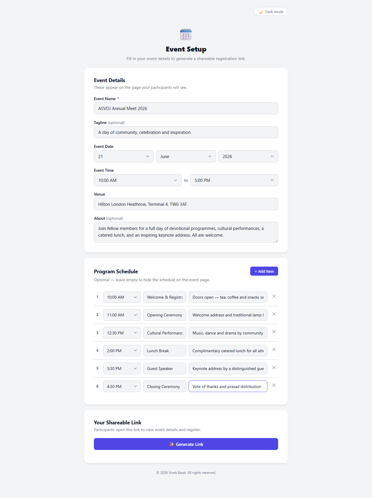

---

### Step 3 — Generate and Share the Link

Click **✨ Generate Link**. The system encodes all event details into a unique URL.

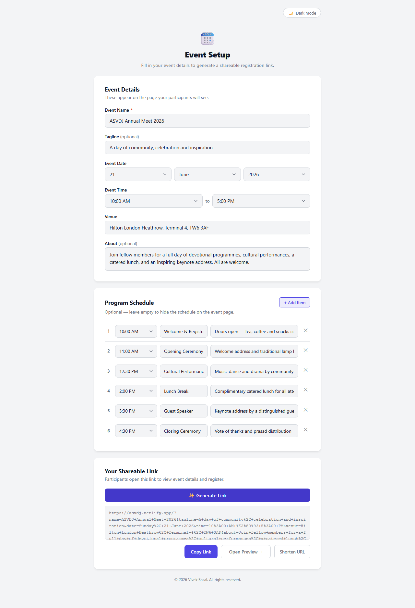

You have three options:

| Button | Action |
|---|---|
| **Copy Link** | Copies the full URL to your clipboard |
| **Shorten URL** | Calls the TinyURL API and replaces the long URL with a short one (e.g. `https://tinyurl.com/asvdj2026`) |
| **Open Preview →** | Opens the participant-facing event page in a new tab for review before sharing |

Share the link via WhatsApp, email, or any messaging platform. No login required for participants.

---

## Part 2 — Participant: Registering for an Event

When a participant opens the shared link, they see the full event page followed by a **three-step registration form**.

---

### Event Page

The top of the page displays the event banner, key details, and the programme schedule.

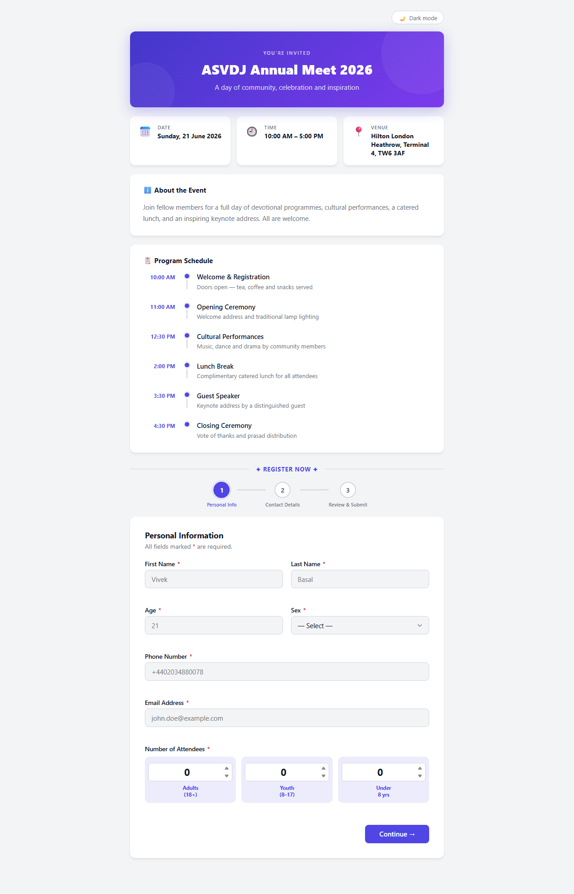

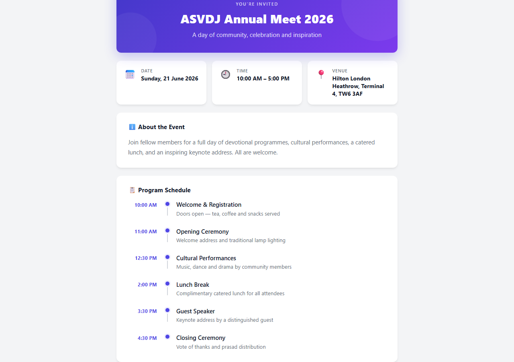

---

### Step 1 — Personal Information

Participants fill in their personal details and the number of people attending with them.

| Field | Example Value |
|---|---|
| First Name | Priya |
| Last Name | Sharma |
| Age | 34 |
| Sex | Female |
| Phone Number | +44 7911 123456 |
| Email Address | priya.sharma@gmail.com |
| Adults (18+) | 2 |
| Youth (8–17) | 1 |
| Under 8 yrs | 1 |

All fields are validated in real time — required fields turn green when correctly filled and red with a helpful message if left empty or invalid.

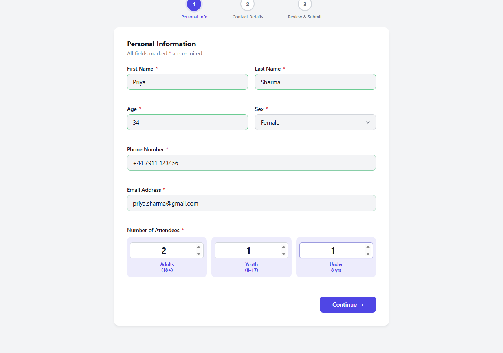

Clicking **Continue →** moves to Step 2. The step indicator at the top updates to show progress.

---

### Step 2 — Address Details

| Field | Example Value |
|---|---|
| Complete Address | 12 Maple Drive, Slough, Berkshire |
| Post Code | SL1 5AP |

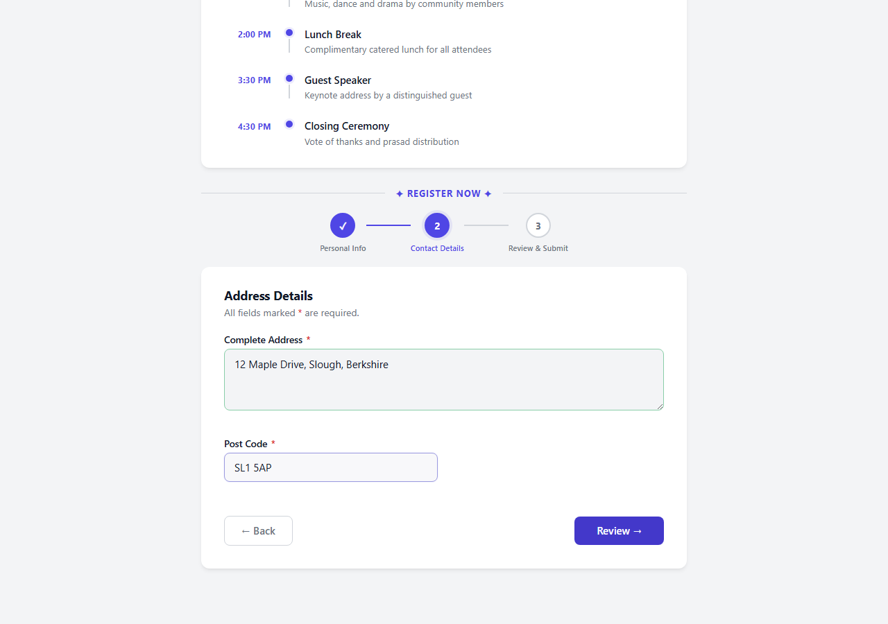

Clicking **Review →** moves to the final step.

---

### Step 3 — Review & Submit

A summary of all entered information is displayed for the participant to verify before submitting. An optional **Remark** field (up to 300 characters) is available for any notes or dietary requirements.

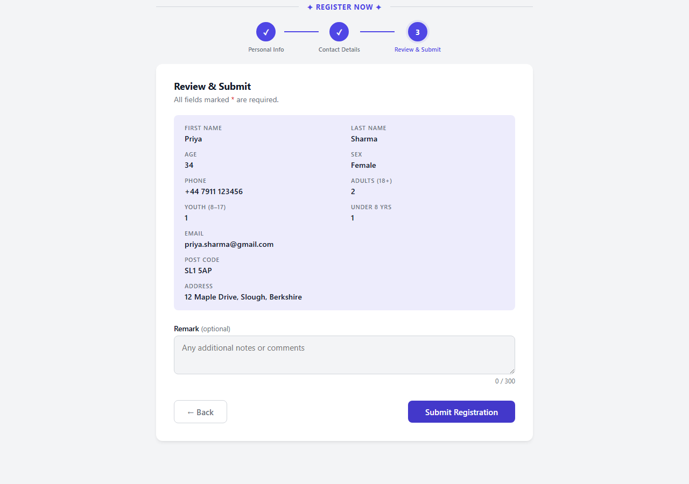

Clicking **Submit Registration** sends the data securely to the backend.

---

### Submission Confirmed

On successful submission, the form is replaced by a confirmation screen.

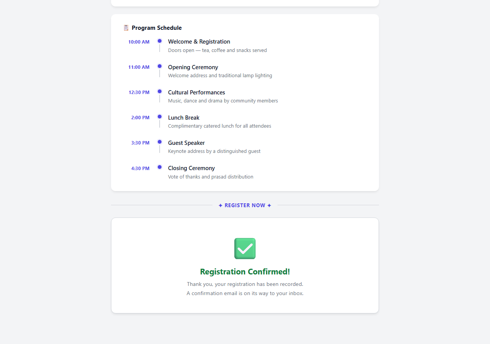

---

## Confirmation Email

Within seconds of submitting, the participant receives a confirmation email at the address they provided.

The email includes:
- The participant's name
- The event name, date, time, and venue
- A clear "You are registered" confirmation banner

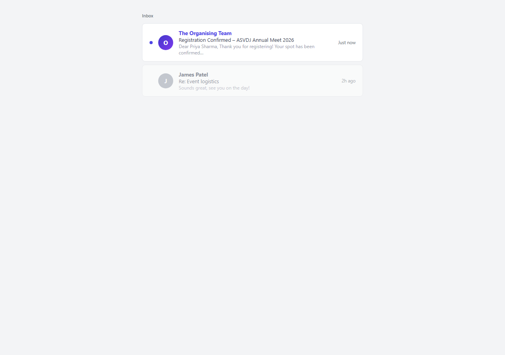

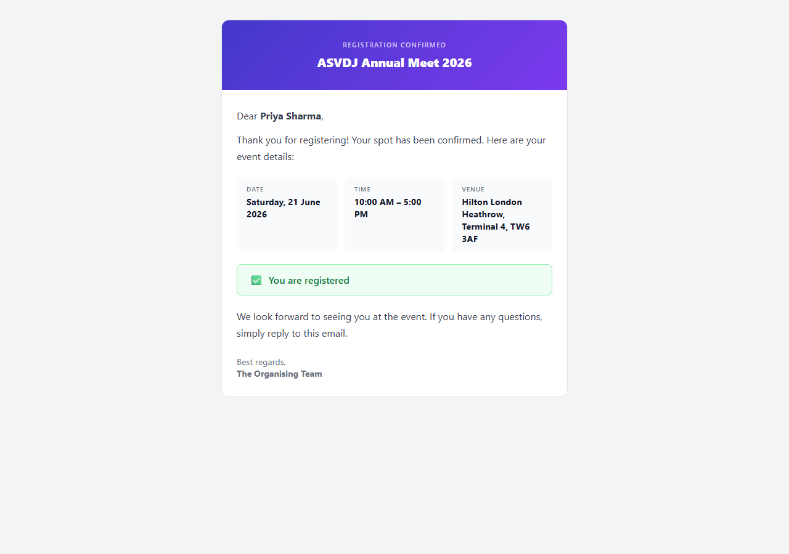

**Sample email for the above registration:**

> **Subject:** Registration Confirmed – ASVDJ Annual Meet 2026
>
> Dear Priya Sharma,
>
> Thank you for registering! Your spot has been confirmed. Here are your event details:
>
> | | |
> |---|---|
> | **Date** | Saturday, 21 June 2026 |
> | **Time** | 10:00 AM – 5:00 PM |
> | **Venue** | Hilton London Heathrow, Terminal 4, TW6 3AF |
>
> ✅ You are registered
>
> We look forward to seeing you at the event. If you have any questions, simply reply to this email.
>
> Best regards,
> The Organising Team

---

## Data Storage — Google Sheets

Every registration is automatically appended as a new row in a connected Google Sheet. The organiser can view, filter, export, or share the sheet at any time.

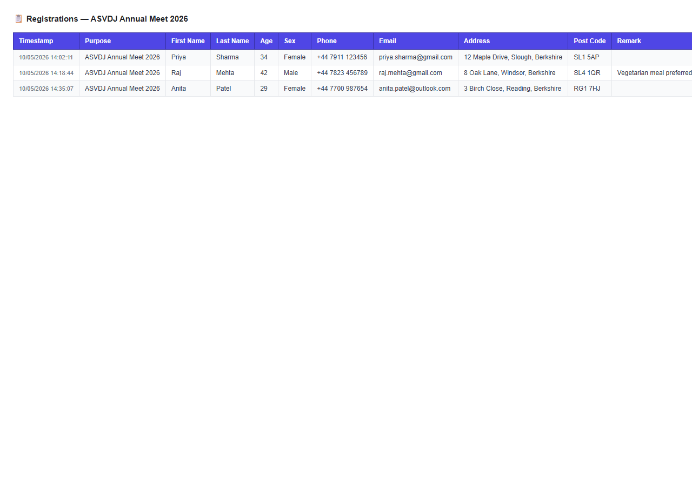

**Columns captured per registration:**

| Column | Description |
|---|---|
| Timestamp | Date and time of submission |
| Purpose | Event name (from the link) |
| First Name | — |
| Last Name | — |
| Age | — |
| Sex | — |
| Phone | — |
| Email | — |
| Address | Full address |
| Post Code | — |
| Remark | Optional notes |
| Adults (18+) | Count |
| Youth (8–17) | Count |
| Under 8 | Count |

**Duplicate prevention:** If the same email address submits for the same event more than once, the system silently rejects the duplicate — no double entries in the sheet.

---

## Features

| Feature | Detail |
|---|---|
| No installation | Runs entirely in the browser — no app to download |
| Mobile responsive | Works on phones, tablets, and desktops |
| Dark mode | Toggle in the top-right corner |
| Instant link generation | Event details encoded in the URL — no database needed for event config |
| URL shortening | One-click TinyURL shortening — stays on the page |
| Real-time validation | Inline field validation with clear error messages |
| Animated step indicator | Three-step progress bar with back/forward navigation |
| Duplicate detection | Blocks repeat registrations per email per event |
| Automated emails | HTML confirmation email sent automatically on registration |
| Google Sheets backend | All data in a spreadsheet the organiser already owns |
| Programme timeline | Visual connected timeline on the event page |
| Dark/light theme | Persisted across sessions via localStorage |

---

&copy; 2026 Vivek Basal. All rights reserved.
